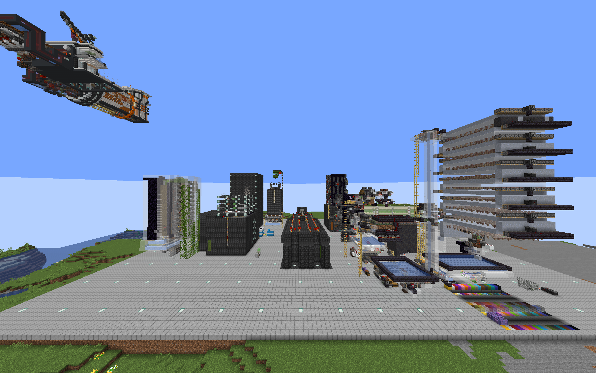

# 第一天

本节将带领你游览 FDCraft｜复读世界𒆙的主要区域。游览后，你将对本服务器的大致情况有一个整体把握。

你可以选择跟随下方的指南，取用公共物资来进行建设；你也可以选择不看下面的指南，自己生存：一切都取决于你自己。

未来的旅程充满未知与惊喜，开始新的旅程吧，大冒险家！

## 世界树与新的旅程

欢迎来到 FDCraft｜复读世界𒆙！进入服务器，出现在视线中的是一个红色的鸟居，以及其背后的巨大的樱花树（至少看起来像樱花树）。这棵树被称为世界树，它从神秘的末地生长而出，承载着这个世界的秘密。正因此，你正处于的这个世界，FDCraft 的大厅，被命名为“世界树之渊”。

::: tip 
请走过鸟居，沿着围绕树干的小路向上走，参观世界树顶端的小亭子。
:::

站在小亭子上俯瞰这个地图，你会发现围绕着世界树有三个建筑。

北侧的是【祈愿中心：子虚亭】。二周目时可以在这里投币祈愿获得物品；三周目这里暂时没有被使用，等待着某天再次散发光辉。

东侧的是【平行世界传送中心】。这里是服务器的传送中心。

南侧的是一座建立于很久以前的神社，供奉着未知的神明。

::: tip 

请前往【平行世界传送中心】，了解各个传送门通向的世界。

 :::

参观了【平行世界传送中心】，接下来请通过传送门前往FDC。

::: tip 

点击左侧聊天栏的 [FDC] 按钮，或者输入`/server fdc`，也可以进入主服务器。

请你试试点击相关链接下面的按钮，看看会显示什么。
:::

## 出生点

进入FDC，出现在你眼前的应该是南面的复旦大学的校徽。

> 学会查看[【旦星一号】](http://mc.fdc.jingyijun.xyz:20410/)是很重要的技能，你能从中迅速找到某个建筑的位置。

出生点附近的箱子和潜影盒装有一些物资。你可以从中获取一些类似镐子食物之类的起始物资。

有时候，中间的箱子里面会一些鞘翅。鞘翅的数量比较有限，~~且难以再生~~。如果你只是来服务器参观，请不要取用鞘翅，善用/tpa传送。潜影盒中可能会有用于飞行的3级烟花火箭。

:: tip

现在鞘翅可以通过在末地挖末地石爆宝箱来获取，但是爆率有限。

:::

## 出生点小镇

在出生点东侧，就是出生点小镇。

在服务器的早期，几个玩家在出生点安家，建立了出生点小镇。

## 复读地铁一号线

在出生点北面，能看到一个巨大的入口。这是复读地铁1号线的出生点站。

::: tip 

请进入地铁口。乘坐地铁前往下一站——工业区北站。

注：大部分站点配备了半自动发车装置。若没有矿车，请自行想办法（自己挖矿合成/找人白嫖/...）

:::

>  提示：复读地铁遵从靠右行驶的交通规则，逆行会遭到截停。为防止与他人发生碰撞等交通事故，请务必遵守此规定！

> 如果你知道下界交通如何使用的话，也可以通过下界交通游览。可以在[旦星一号的下界地图](http://mc.fdc.jingyijun.xyz:20410/#world_nether;flat;1,64,0;4)中查看线路。

## 工业区

乘坐复读地铁1号线，你到达的第一站是工业区北站。

::: tip

尝试着使用工业区北站的无障碍电梯上行吧！

:::

工业区北站的南面是工业区。工业区是FDCraft最活跃的地方之一，聚集了大量的生电机器获取物资。

FDCraft 是一个和谐互助的服务器。冒险家们经常建造一些有趣而高效的功能性建筑。大家会把自己建造的公共功能性建筑记录在[【复读百科】](https://docs.qq.com/doc/DR0lJYVhWcGZUa0lk)与[【旦星一号】](http://mc.fdc.jingyijun.xyz:20410/#world;surface;724,64,83;5)中。

::: tip

工业区北站附近还有很多有趣的建筑，在周边逛一逛看看都有哪些建筑吧！

:::

## 村庄

回到地铁站，乘坐复读地铁1号线前往下一站——村庄站。

村庄是FDC的第一个大型聚集地，主要放置了一些与农业相关的机器，大量玩家在此定居。

::: tip

查看[【旦星一号】](http://mc.fdc.jingyijun.xyz:20410/#world;surface;778,64,362;5)看看哪些玩家居住在村庄！

:::

位于西面的是开荒仓库，这是FDC的第一个仓库，经过了多次改建后变成了现在的中世纪建筑。如今这里已经不再存放物品，供奉着神秘的神明。

## 雪原区

输入`/warp snowy`，就能能来到远东的雪原区。

> 不乘坐复读地铁1号线是因为沙堡-雪原区暂未开通。下界交通可以到达雪原。

雪原区主要是一些与雪有关的建筑，建筑之间相隔都比较远。你可以在[【旦星一号】](http://mc.fdc.jingyijun.xyz:20410/#world;surface;3538,64,-173;5)中看到这些建筑的位置。

## 住宅区

现在输入`/warp residential`，就能直接来到住宅区的下界传送门广场。住宅区是一片广阔的区域，非常多的玩家在此建造自己的别墅与观赏建筑。

::: tip

在住宅区转一下，看看这里都有哪些建筑！

:::

从下界传送门广场向东拾级而下，沿路向东走到底，能看到一座神殿。神殿内供奉着一位神秘的神明，他庇护着服务器的玩家，使玩家的机器与建筑不会被苦力怕或凋零所破坏。

从神殿的中央水柱向下，就来到了物品仓库。物品仓库储存了几乎所有种类的物品，也可以进行简单的物品分类。在这里可以取用建筑所需的材料。

> 地面上右侧的大箱子为输入，左侧为未分类物品输出，不能分类不可堆叠物品。由于运行需要，取用物品时需要留下一个物品或者使用占位玻璃。

::: tip

如果住宅区的材料不够用，你需要前往相应的机器来获取（如圆石），或者自行挖取（如珊瑚块）。有些特殊物品则需要通过在特定群系挖矿爆宝箱要获取（如隐形展示框，Indestructia鞘翅）。

:::

## 第一个庇护所

从神殿的中央水柱向上离开神殿，能看到复读公寓。

【复读公寓】是高耸入云的反牛顿建筑。所有玩家都可以在此处免费领取一间住房，作为自己的初始小屋。

::: tip 领取流程

你需要准备：告示牌x1

1. 前往复读公寓。
2. 从公寓大厅开始，一层一层上楼，找到第一个没有被认领的楼层。
3. 在门旁贴上门牌（格式与位置参见其他已被领取的楼层）
4. 站在认领的复读公寓初始小屋内，使用`/sethome`指令设置家。离开家后，可以使用`/home`指令回家。
5. 前往[复读百科](https://docs.qq.com/doc/DR0lJYVhWcGZUa0lk)更新你的住宅信息！

:::

::: tip 使用说明

1. 可以在房间内进行任意内饰装饰，但不能修改外部墙体。
2. 禁止破坏地板，天花板可以破坏至多一格深。
3. 阳台的四格草方块可以种植植物，也可以破坏。

:::

需要注意的是，使用指令设置的家与床设置的个人出生点无关。可以使用`/home bed`回到床。

> 了解更多服务器的指令，请参阅[指令帮助](/guide/commands)。

当然你也可以选择那些已经装修好的建筑入住，或者建造属于自己的建筑。

## 开始新旅程

至此，“第一天”的指引就结束了。你可以继续浏览本网站以了解更多，也可以在遇到问题时通过本网站查询资料。当然，在群里与朋友们进行交流可能是解决问题的最快方法。

未来的旅程充满未知与惊喜，开始新的旅程吧，大冒险家！