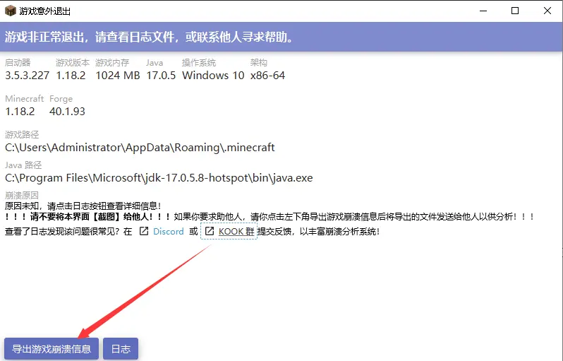

# Episode1 崩溃报告和日志在哪里？

> Troubleshooting any problem without the error log is like driving with your eyes closed. 
>
> 在没有错误日志的情况下诊断任何问题无异于闭眼开车。
>
> ——Apache官方文档 
>
> [Getting Started - Apache HTTP Server Version 2.5](https://httpd.apache.org/docs/trunk/getting-started.html#logs)

想要诊断崩溃报告和日志，你首先要找到/获取崩溃报告（crash-report.txt）和日志（.log），才能知道究竟报了啥错。正如酒石酸所说：发生崩溃时如果找不到崩溃报告，就说“我崩溃了怎么办”，还不如上街找个算命先生算算为什么崩溃好些。

如果有人只问了问题，或者只把HMCL那个带有黑色粗体字“！！！请不要将本页面【截图】给他人！！！”的界面截图发过来，我建议你将这篇的前言复制下来丢给他（或者下面那张图），再将这篇教程丢给他。

当然，必要的时候你也可以打出下面这张图：

这两张图特意使用了png，以便复制到QQ群中。好，让我们言归正传，崩溃报告和日志究竟在哪里呢？

## 面向普通玩家

### HMCL

游戏崩溃后在崩溃界面点左下角“导出游戏崩溃信息”（不要点“日志”！），然后把导出的压缩包整个发到KOOK/群文件。

### PCLII

游戏崩溃后在崩溃界面点“导出崩溃报告”，然后把导出的压缩包整个发到KOOK/群文件。

如果你是普通玩家，看到这里已经可以照着上面的去做，并关掉这篇教程了。

**但是，如果你是一个运维……这还远远不够。**

## 面向运维

### 解压压缩包

将启动器发送的压缩包解压到某个文件夹中，即可获得崩溃报告和日志。有时候压缩包里面没有崩溃报告，这是正常现象；如果压缩包里面的崩溃报告/日志没有完全导出而有缺少，你需要去直接获取崩溃报告/日志（或者去教那个普通玩家直接获取）。

### 直接获取

打开MC安装目录（在有版本隔离的情况下为.minecraft/version/{version_name}，没有则为./minecraft，服务器为服务端所在目录），找到crash-report文件夹里面那个最新的文件，就是最近一次崩溃的崩溃报告。

在安装目录里找到logs文件夹，里面的latest.log和debug.log就是最近一次启动的日志。而压缩包则是历史日志，其名称表明了其为那天的第几个日志（如2023-06-02-3.log.gz就是2023-6-2的第三个日志。）

::: tip 注意

有不少情况是不输出崩溃报告的，此时日志就成为了诊断的依据。

:::

::: warning 警告

作为一个正常的程序，MC每次启动都会打印日志，无论其是否崩溃。

也就是说，找到的崩溃报告与日志有可能是不匹配的。

:::