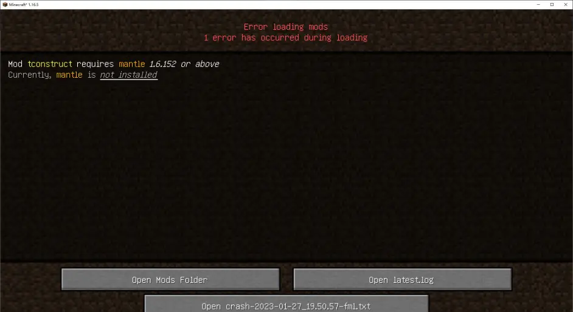

# Mod Loading has failed

顾名思义，有一个Mod加载时发生了错误。这种情况还有一个明显的特征：Details部分会出现Mod Info，指示是哪个Mod出现了问题。一般来说这种异常会发生在`fml`，但有时候也会发生在`server`。

## 前置缺失&版本错误

一个可能的原因是有Mod缺少了前置或前置版本错误，在Mod Info的`Failure message`中会提示需要的Mod与其版本要求。

解决方法也很简单：按照提示安装相应的Mod。

一个例子：[crash-2023-05-10_22.55.41-fml.txt](https://cloud.fdc.jingyijun.xyz/CrashReports/crash-2023-05-10_22.55.41-fml.txt)

```markdown
Description: Mod loading error has occurred

java.lang.Exception: Mod Loading has failed
	at net.minecraftforge.logging.CrashReportExtender.dumpModLoadingCrashReport(CrashReportExtender.java:55) ~[forge-1.18.2-40.2.1-universal.jar%2394!/:?] {re:classloading}
	at ...

...

-- MOD meetyourfight --
Details:
	Mod File: /C:/Users/Akari/Desktop/1.18create/mods/meetyourfight-1.18.2-1.2.5.jar
	Failure message: Mod meetyourfight requires curios 1.18-5.0.2.3 or above
		Currently, curios is not installed
```

在日志中，这个异常长得会不太一样，不过依然一眼就能看出来：

```java
[16:39:34] [Client thread/ERROR] [FML/]: The mod manametalmod (ManaMetalMod) requires mod versions [Muya@[1.7.1,1.7.1]] to be available 
```

```java
[22:55:00] [Server thread/ERROR]: Encountered an unexpected exception
net.minecraftforge.fml.common.MissingModsException: Mod jecalculation (Just Enough Calculation) requires [jei@[4.15.0.268,)]
	at net.minecraftforge.fml.common.Loader.sortModList(Loader.java:266) ~[Loader.class:git-CatServer-1.12.2-4d54207]
	at net.minecraftforge.fml.common.Loader.loadMods(Loader.java:572) ~[Loader.class:git-CatServer-1.12.2-4d54207]
	at net.minecraftforge.fml.server.FMLServerHandler.beginServerLoading(FMLServerHandler.java:97) ~[FMLServerHandler.class:git-CatServer-1.12.2-4d54207]
	at net.minecraftforge.fml.common.FMLCommonHandler.onServerStart(FMLCommonHandler.java:336) ~[FMLCommonHandler.class:git-CatServer-1.12.2-4d54207]
	at net.minecraft.server.dedicated.DedicatedServer.func_71197_b(DedicatedServer.java:169) ~[nz.class:?]
	at net.minecraft.server.MinecraftServer.run(MinecraftServer.java:642) 
```

很多启动器、高版本的Forge与Fabric已经能自动识别这种错误，因此目前见到的这种情况的崩溃非常少。



## Mod损坏

另一个可能是有Mod损坏。如果Mod Info的提示不是上面那种情况，基本都是这种情况。

解决方法是重新下载安装相应的Mod。

一个例子：[crash-2023-05-14_23.39.07-fml.txt](https://cloud.fdc.jingyijun.xyz/CrashReports/crash-2023-05-14_23.39.07-fml.txt)

另一个例子是在Episode2出现的用于讲解的崩溃报告：[crash-2023-01-28_17.16.47-fml.txt](https://cloud.fdc.jingyijun.xyz/CrashReports/crash-2023-01-28_17.16.47-fml.txt)。其出错的原因是Forge的核心文件发生了损坏，此时就需要重新安装Forge。

